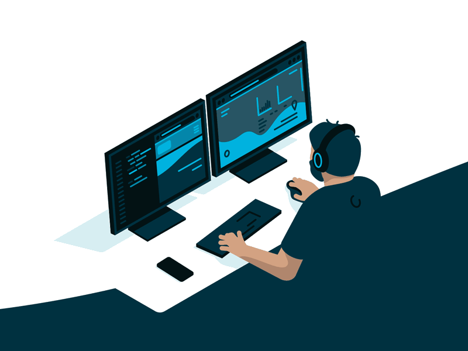

<h1> Hey! Nice to see you.</h1>

Welcome you to be a part of LTV software developer team! 
  I'm Phong Lee from  <b>VietNam</b>, currently working as a Fullstack developer for  <b> LTV Software Organization</b> in VietNam. 
  <b>Today</b>, I will guide through step by step not only the necessary technical requirements for a LTV developer   but also  the company culture .

## Let's get started
If you're already have experience in <b> Software Development </b> field (1-2 years and more) then please checkout this document <a href="#">Experience developer document</a>.
  And if you're newbie then checkout this document <a href="#">LTV developer started document</a>.
  *Try to think of this document as a reference tool*; I hope it is something that you can learn 📚 and adapt to your work faster 📈.

 

<h1 align='center'>⚡️<i>Our approach is making everything easier</i>⚡️</h1>

   

