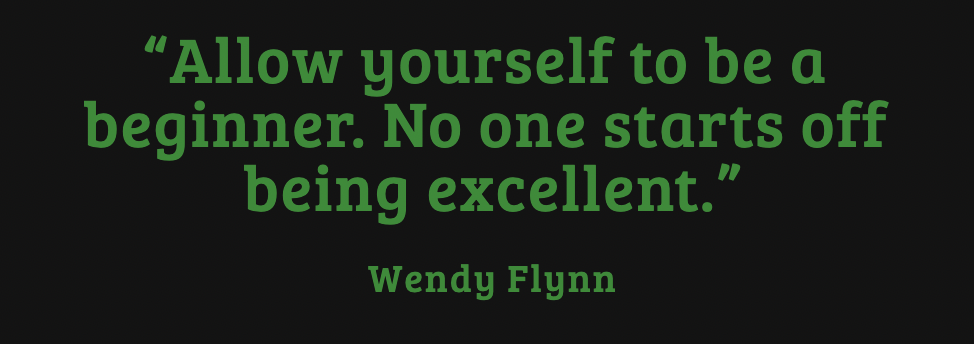
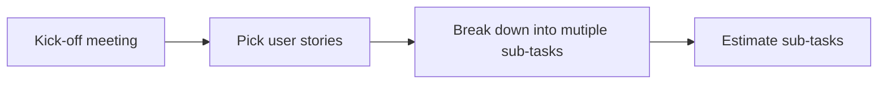
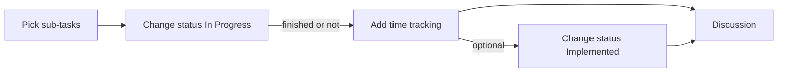
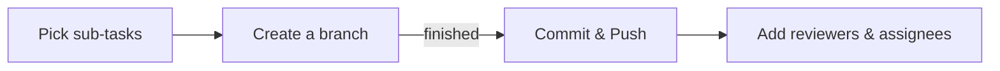

<!--💬GREETINGSTITLE / 🌐WEBSITE: https://github.com/denvercoder1/readme-typing-svg -->

 

<h1> Welcome back, <𝚍𝚎𝚟𝚎𝚕𝚘𝚙𝚎𝚛𝚜/>! </h1>

<!--💬QUOTESTITLE / 🌐WEBSITE: https://textanim.com/ -->

<!--💬🃏QUOTESCARD / 🌐WEBSITE: https://github.com/PiyushSuthar/github-readme-quotes#Demo & https://github.com/shravan20/github-readme-quotes -->

## Table of contents
- 🍷 [Introduction](#introduction)
- 🛠️ [Technical Knowledgement](#heading1)
  * [Jira Software](#heading1.1)
    + [Pick the User story/Requirements for the sprint](#heading1.1.1)
    + [Pick the task and start work](#heading1.1.2)
  * [Github](#heading1.2)
    + [Github workflow](#heading1.2.1)
  * [Slack](#heading1.3)
    + [Vacation tracker](#heading1.3.1)
- ⛔ [Common Problems as a Beginner](#heading2)

## Introduction  

 This is a document about knowing and learning beginner technical requirements. But it's also more. It will help you speed up the learning process and observe team workflow way faster 🚀. 
   Each section is independent; you don't need to read it in order, so if there is a particular section you are interested in, feel free to skip to it. Let's get started! 🌱

## I. Technical Knowledgement  
The first thing I want to discuss 💬 are some technical problems when I was a beginner joining a Software Development Team. I found it difficult to know where I need to start and what need to do 📝. So here are some common problems I have faced to let you guys know what to focus on and how to start working as a team member in an LTV Development Team.

### 1.1. Jira Software 
Jira is a software application used for <b>issue tracking and project management</b> being operated and used in the company. So here are some notes you have to remember 📝.

#### 1.1.1. Pick the User story/Requirements for the sprint 💎 
- ▶️ In each sprint , the kick-off meeting will be happening on the 1st day of the sprint.
- ⏩ In the kick-off meeting , the development team **`MUST`** pick the User Stories / Requirements that will be burning within the sprint.
- ✅ The Product Owner **`MUST`** check and confirm the User Stories / Requirements picked from Development Team.
- #️⃣ After the kick-off meeting an hour, the development team **`MUST`** break down the User Stories into multiple (or single) sub-tasks.
- ⏲️ Every single sub-tasks must be estimated and the estimation time **`MUST`** be less than or equal **to 8 hours**. The fix-version, sprint, labels **`MUST`** be filled in each task.
- 🤝 The Project Leader **`MUST`** check and make sure all the sub-tasks are estimated and all the User Stories can be finished within the sprint. If not, please arrange the ad-hoc meeting to re-arrange the meeting to align again.
- 🎯 The Project Leader update the sprint goal (Sprint description).

#### 1.1.2. Pick the task and start work 💎 
- ⏲️ In the daily meeting, the development team will pick the sub-tasks that they can finish within that day. Total hours of the picked tasks are **no greater than 8 hours**.
- 💻 Change the status to **`In Progress`**.
- ⏳ Add Time Tracking at the end of the day **(Even finished or not)**.
- ✅ Update the status to **`Implemented`** (optional). if complete the task.
- 💬 Comment on task if there is any concern or discussion.

### 1.2. Github 
Yes! Hand down, Github is the most used service of any IT organization including LTV and I know that you already have some experience using Git but working as a team is a whole different thing. 
  So knowing how to use it as a team is a crucial skill you need to know and work on. Here are some step by step how to use Github and learn Github workflow in LTV that you need to check out. 

#### 1.2.1. Github workflow 💎 
- 🔀 After picking the task, **`MUST`** create the branch from main with the name following the task issue ID. E.g: `feature/TAS-55`
  * `feature` is task type. E.g: 🔧 feature / 🐛 bugfix / 🧪 improve / 💅 refactor
  * `TAS` is the project key
  * `55` is the issue number
- ✅ Push the code to branch after finished, commit with convention (E.g: _feat(frontend): login with google provider | JIRA: TAS-55 #time 4h, TAS-56 #time 2h_.
- 👤 Add the reviewer (backend → @Cuong Phan + @Luc , frontend → @Luc).

### 1.3. Slack 
Slack is a messaging program designed specifically for the office, but has also been adopted for personal use. LTV are using it for member communication when _working from home_.

#### 1.3.1. Vacation tracker 💎 
So you want to have a day off; Vacation Tracker is an easy-to-use leave tracking tool that simplifies the way you manage your teams' PTO requests, work from home days, sick leaves and more - directly from Slack.
<a href="https://www.youtube.com/watch?v=5-Zsjgx6ctc">How to use Vacation Tracker</a>

## II. Common Problems as a Beginner 
- ❗*Not asking for support*: This is the biggest problem of all. Trying to work on a problem by yourself but not knowing where to start and what to do is time-consuming for not only you but other team members. So if you find that the problem is kinda hard for the current skill level you have or not know to solve it then asking other developers for help is the **`BEST`** solution.
- ❗*Not asking questions*: *“What the hell is going on?”* after reading the requirements or in a team meeting. Do not understand the requirements or some confusion and again all you need to do is just **`ASK`**; Instead you just silently work on your idea despite the confusion you have.
- ❗*Not spending time for team communication*: Spending time chatting or talking with other developers is a great way to learn faster and make connection in a team; Because in different projects you will work with different team member so make a move not harm anything.
- ❗*Not reading this document*: Yeah! You need to read this document. 

 <em><b>Thank you for spending time reading</b> so if you have any suggestions please let me know. <b>I'll be happy to help you more!</b> 😊 
   &nbsp;&nbsp;&nbsp;&nbsp;&nbsp;&nbsp;&nbsp;&nbsp;&nbsp;&nbsp;&nbsp;&nbsp;&nbsp;&nbsp;&nbsp;&nbsp;&nbsp;&nbsp;&nbsp;</em>
 

